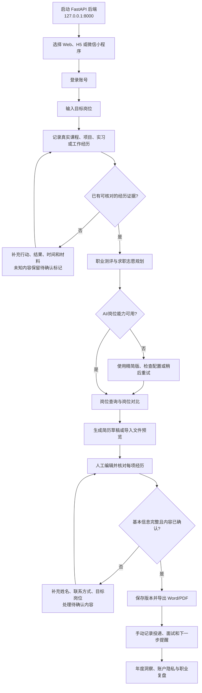

# AI 岗位查询与智能简历生成

一个本地可运行的求职辅助 Demo，包含 Uni-App 微信小程序/H5 前端、独立 Web 工作台与 FastAPI 后端。

仓库地址：`https://github.com/wjh941/ai-resume`

**线上 Demo（Web 工作台）**：`https://ai-resume-workbench.vercel.app`（前端 Vercel + 后端 Render 免费档；后端闲置会休眠，首次访问约需 30-50 秒唤醒，属免费档正常行为）

**项目主页（GitHub Pages）**：`https://wjh941.github.io/ai-resume/`（由 `site/` 静态站与 GitHub Actions 自动部署）

## 项目亮点

**三端一体的求职工作台**：FastAPI 后端 + uni-app 小程序/H5 + Vue3 Web 工作台，单仓库、同一套 JWT 账号体系与 12 大类 / 204 岗位的本地知识库。

```text
┌─────────────────┐  ┌─────────────────┐  ┌──────────────────┐
│  微信小程序 / H5  │  │  Web 工作台      │  │  运营端点          │
│  uni-app + Pinia │  │  Vue3 + Vite     │  │  知识库/推送/订单   │
└────────┬────────┘  └────────┬────────┘  └────────┬─────────┘
         └────────────┬───────┴────────────────────┘
                JWT (token_version) · HTTPS
                      ┌─────▼─────┐
                      │  FastAPI   │ RBAC · 每用户限流 · 结构化日志
                      │  仓储层隔离  │──► SQLite (WAL) 或 PostgreSQL
                      └─────┬─────┘
              ┌─────────────┼──────────────┐
        本地岗位知识库    AI 网关(可降级)   Word/PDF 导出
```

| 指标 | 数值 | 说明 |
| --- | --- | --- |
| 自动化测试 | **653 个**（后端 234 · 小程序 163 · Web 256） | 每阶段改动全量回归，0 失败基线 |
| 小程序主包 | **854KB → 448KB（-47.5%）** | 构建期剔除 H5 专有产物 + `lazyCodeLoading` + 四页 tabBar |
| 接口延迟 | 核心链路 **毫秒级**，AI 生成步 30~90s | AI 规划/匹配走中转模型，超时或格式异常自动降级精简版；可用 `scripts/smoke_e2e.py` 复现 10 步全链路 |
| Web 首屏 | 入口 25.5KB / gzip 10.3KB | Vue 与图标库独立 vendor 分块长期缓存，视图按需分块 + 悬停预热 |
| 离线能力 | 投递记录本机队列 + 表单本地检查点 | 4xx 拒绝入队、毒丸隔离、GET 幂等重试语义 |
| 云端部署 | Vercel 前端 + Render 后端蓝图 | `render.yaml` 一键建站，`VITE_API_BASE_URL` 指向后端，见「部署概览」 |

工程取舍的完整讲述见 [面试/深度导读](docs/interview-notes.md)。

## 功能与使用指南

这是一个把“经历整理、岗位决策、简历制作、投递跟进”串起来的求职行动工作台。系统会把你的真实经历整理成可核对的证据和简历草稿，帮助你决定下一步做什么；它不会虚构经历、代替你投递，也不会把岗位匹配分数当成录用承诺。

### 先选择使用入口

三个入口共用 FastAPI 后端和同一套账号数据，但适合的使用场景不同：

| 入口 | 适合场景 | 主要能力 | 本地地址/产物 |
| --- | --- | --- | --- |
| 独立 Web 工作台（`web-frontend`） | 桌面浏览器、长时间编辑 | 工作概览、简历中心、经历证据、职业规划、岗位机会、投递管理、会员与账户 | `http://127.0.0.1:5174` |
| H5（`resume-miniprogram`） | 手机浏览器、快速查看和操作 | 岗位情报、职业规划、岗位对比、职业测评、简历填写与编辑、草稿箱 | `http://127.0.0.1:5186` |
| 微信小程序 | 微信内的移动端使用 | 与 H5 共享业务流程，支持登录、岗位、简历、证据、投递、订单等页面 | 导入 `resume-miniprogram/dist/build/mp-weixin` |

后端不是单独的用户入口，而是三种前端共用的 API 服务。第一次运行时建议先启动后端，再选择一个前端登录。

### 功能地图

#### 准备资料

- **工作概览**（canonical Web view key: `overview`）：查看当前简历、职业方向、待办行动和工作台进度。
- **简历中心**（canonical Web view key: `resume`；小程序 page path: `resume-form`、`resume-editor`、`drafts`）：创建、打开、复制、删除和管理多份简历草稿；可按目标岗位保留不同版本。
- **经历证据**（canonical Web view key: `evidence`；小程序 page path: `evidence`）：记录真实课程、项目、实习和工作经历，补充行动、结果、时间和可验证材料。
- **简历导入与检查**：上传 PDF/Word 后先生成结构化预览草稿；缺少姓名、手机号、邮箱或目标岗位时，系统会提示补充。

#### 职业决策

- **职业测评**（canonical Web view key: `assessment`；小程序 page path: `career-assessment`）：从兴趣偏好、工作方式、证据优势和现实约束出发，形成职业信号。
- **职业规划**（canonical Web view key: `career`；小程序 page path: `career-planner`）：输入专业、技能、城市和行业偏好，生成冲刺、稳妥、保底三档岗位方向。
- **岗位机会/岗位情报**（canonical Web view key: `jobs`；小程序 page path: `job-search`、`job-collection`）：输入目标岗位，查看岗位职责、硬性门槛、优先技能、加分技能、职业路径和面试核验问题。
- **岗位对比**（canonical Web view key: `comparison`；小程序 page path: `role-comparison`）：选择 2-4 个本地岗位，比较匹配依据、技能缺口、风险提示和 7/30/90 天行动计划。
- **年度洞察**（canonical Web view key: `insights`）：按岗位和资料年份查看已归档的公开资料摘要、行动建议和来源说明；它不是实时招聘数据。

#### 求职执行

- **投递管理**（canonical Web view key: `applications`；小程序 page path: `applications`）：手动记录公司、岗位、城市、来源、状态、下一步日期和关联简历。
- **跟进时间线**：记录沟通、面试和复盘事件，避免把关键进展只放在聊天记录里。
- **面试提醒**：为下一步行动设置日期，并在投递记录中持续更新状态。
- **岗位收藏**：保存感兴趣的岗位，后续加入岗位对比或投递计划。

#### 复盘与账户

- **简历版本与导出**：保存版本快照，人工确认内容后导出 Word/PDF。
- **会员与订单**（canonical Web view key: `membership`；小程序 page path: `membership`、`orders`）：查看当前权益、套餐、订单和演示支付状态；真实支付能力取决于后端配置。
- **账户设置**（canonical Web view key: `account`；小程序 page path: `account`）：查看数据范围，记录隐私确认，下载账户数据 ZIP，或提交账户删除申请。
- **本地隐私**：清理当前设备上的草稿检查点、职业规划、测评、咨询和待同步队列；服务端数据仍需在对应页面单独处理。

### 主要使用流程

1. **启动并登录**：启动后端后打开 Web、H5 或微信小程序。开发环境可使用演示验证码 `123456`，也可以使用账号密码登录；生产环境应关闭演示验证码。
2. **确定目标岗位**：先输入一个具体岗位名称，例如“数据分析师”，再开始整理证据和规划，不要一开始同时维护过多方向。
3. **建立经历证据**：把课程、项目、实习或工作拆成“背景—行动—结果—时间—材料”。没有真实结果的内容保留 `[待确认]`，不要直接当成事实导出。
4. **做测评和职业规划**：测评用于识别职业信号，职业规划用于生成冲刺、稳妥、保底方向；两者都是决策参考，需要结合你的真实情况判断。
5. **查询和比较岗位**：在岗位机会中查看门槛与技能缺口，必要时选择 2-4 个岗位做横向对比。专业版、联网搜索和部分 AI 能力受后端配置、会员权益和网络状态影响。
6. **生成并编辑简历**：从简历中心创建草稿，或导入 PDF/Word 生成预览；逐项补齐基本信息、目标岗位和经历内容，确认所有 `[待确认]` 标记后再保存正式版本。
7. **导出和投递**：确认内容无误后导出 Word/PDF。投递管理只记录你已经完成或准备完成的投递，不会登录第三方招聘网站，也不会自动提交申请。
8. **跟进和复盘**：为每条投递记录状态、面试事件和下一步提醒；定期查看年度洞察和账户数据范围，决定下一轮简历或岗位策略。

### 主流程图



流程图中的“手动记录投递”是产品边界：系统不会自动登录招聘网站、抓取第三方 JD 或代替你提交申请。联网市场信息检索默认关闭；打开前请确认已经配置合法的数据源和授权。

### 快速开始

1. 启动后端：进入 `resume-backend`，配置 `.env`，执行 `uvicorn main:app --reload --host 127.0.0.1 --port 8000`。
2. 选择 Web：进入 `web-frontend`，执行 `npm install` 和 `npm run dev`，打开 `http://127.0.0.1:5174`。
3. 选择 H5：进入 `resume-miniprogram`，执行 `npm install` 和 `npm run dev:h5`，打开 `http://127.0.0.1:5186`。
4. 选择微信小程序：进入 `resume-miniprogram` 后执行 `npm run build:mp-weixin`，再用微信开发者工具导入 `resume-miniprogram/dist/build/mp-weixin`。

详细的环境变量、AI 配置、HTTPS、生产部署和测试命令见下方对应章节。

## 功能

- 岗位情报查询与关联岗位联想
- 按求职身份生成岗位解析、求职建议和工具箱内容
- 简历填写、AI 润色、模板预览、草稿保存与 Word/PDF 导出
- 空白经历生成带 `[待确认]` 标记的项目、实习草稿，不虚构事实
- 经历证据库：先记录真实课程、项目、实习或工作经历，再按目标岗位生成可确认的简历草案
- 简历就绪检查：缺少姓名、手机号、邮箱或目标岗位时阻止模板预览；待确认内容必须由用户明确确认
- 求职志愿规划：基于专业、技能、城市和行业偏好，输出冲刺、稳妥、保底三档岗位建议
- 岗位横向对比：选择 2-4 个本地岗位，比较匹配依据、技能缺口、风险提示与 7/30/90 天行动计划
- 12 个岗位大类、204 个标准岗位、36 个专业的本地知识库
- 岗位匹配评分、专业匹配报告、技能缺口与补齐行动建议
- 可选联网市场信息检索；默认关闭，不会爬取招聘平台
- 简历版本快照、投递时间线、面试提醒记录与职业任务清单
- PDF/Word 简历上传与结构化预览草稿；用户确认后才会覆盖当前填写内容
- 模拟推送分发与发送日志、运营知识库管理入口；运营权限由后端 JWT 角色校验
- 手机验证码与独立账号密码双登录；账号密码仅保存 bcrypt 哈希，适合不接入 SMS 的个人部署

## 目录

```text
ai-resume/
├─ resume-backend/       # FastAPI、SQLite、导出服务与岗位推荐引擎
├─ resume-miniprogram/   # Uni-App Vue 3 小程序
└─ docs/                 # 设计与实施文档
```

## 环境

- Windows 10/11
- Python 3.11+
- Node.js 20+
- npm 10+
- 微信开发者工具，仅在编译或预览微信小程序时需要

## 本地启动

### 1. 启动后端

```powershell
cd resume-backend
python -m venv .venv
.\.venv\Scripts\Activate.ps1
pip install -r requirements.txt
Copy-Item .env.example .env
uvicorn main:app --reload --host 127.0.0.1 --port 8000
```

`requirements.txt` 只包含运行 API、SQLite 与 Word 导出所需的基础依赖（个人部署推荐）。可选能力按需追加安装，均为惰性导入：

```powershell
pip install weasyprint          # PDF 导出（服务器渲染，需系统级 Pango/Cairo）
pip install playwright          # 或浏览器渲染 PDF（另需 `playwright install chromium`）
pip install "psycopg[binary]" alembic sqlalchemy   # PostgreSQL 与迁移工具链
pip install APScheduler         # 独立 worker 进程
```

未安装任何 PDF 渲染器时，PDF 导出返回明确的 `pdf_renderer_unavailable` 错误，Word 导出不受影响。

健康检查地址：`http://127.0.0.1:8000/health`

如需启动单文件工作台对应的本地后端，建议从仓库根目录使用以下脚本：

```powershell
powershell -ExecutionPolicy Bypass -File .\scripts\start-resume-backend.ps1 -Port 8004
```

脚本会检查 `/health` 的 `job_plan`、`job_match`、`ai_setup` 能力声明；端口被旧版本后端占用时会明确拒绝启动，避免页面显示“已连接”但职业规划或岗位匹配接口实际缺失。

### 2. 启动 H5 预览

另开一个 PowerShell 窗口：

```powershell
cd resume-miniprogram
npm install
Copy-Item .env.example .env.local
npm run dev:h5
```

H5 开发服务器固定使用 `http://127.0.0.1:5186`；浏览器打开后，从首页点击“求职志愿规划”即可使用三档职业推荐。后端保持 `http://127.0.0.1:8000`，请不要交换这两个端口。

`VITE_RESUME_API_URL` 留空时，H5 开发服务器会将 `/api` 和 `/downloads` 代理到本机后端 `http://127.0.0.1:8000`。部署 H5 或编译微信小程序前，请在 `resume-miniprogram/.env.local` 中填写已部署的 HTTPS 后端地址，例如：

```dotenv
VITE_RESUME_API_URL=https://api.example.com
```

`premium-dashboard.html` 也通过相同代理运行在 `/premium-dashboard.html`。线上静态部署时，可在页面加载前设置 `window.__RESUME_API_BASE_URL__` 为 HTTPS API 域名。

### 3. 登录方式

所有业务接口和工作台编辑操作均需登录。初次本地启动时，`.env.example` 的 `AUTH_DEMO_MODE=true` 会启用演示验证码：任意合法中国大陆手机号配合 `123456` 即可登录。

登录页同时提供“账号密码”入口，可注册 3-32 位账号和 10-72 字节密码；密码只以 bcrypt 哈希存入独立 `password_account` 表。个人部署不需要 SMS 服务：设置 `AUTH_DEMO_MODE=false`、`SMS_PROVIDER=disabled` 后，直接使用账号密码登录。公开生产环境必须关闭演示验证码；若启用真实短信，再单独完成供应商资质、签名、模板和密钥配置。微信入口目前仍为开放平台授权占位。

登录成功后，后端签发带有 `sub`、`token_version`、`role`、`exp` 的 JWT。后端只使用 JWT 内的用户 ID 查询数据，前端不会提交 `user_id` 或旧版 `client_id`。浏览器临时业务缓存的键名为 `resume-dashboard:{user_id}:{业务键名}`，不同账号不会互相读取。运营人员需由服务端 `OPERATOR_PHONE_ALLOWLIST` 配置并重新登录；隐藏入口不是权限控制手段。

### 4. 构建微信小程序

```powershell
cd resume-miniprogram
npm run build:mp-weixin
```

打开微信开发者工具，导入以下目录：

```text
resume-miniprogram/dist/build/mp-weixin
```

真机、模拟器与正式小程序必须使用可访问的 HTTPS 后端地址：在 `resume-miniprogram/.env.local` 配置 `VITE_RESUME_API_URL` 后重新构建，并在微信小程序后台配置对应的合法域名。无需修改前端源码；前端环境变量不得存放 API Key 等敏感信息。

构建脚本会自动从小程序产物中剔除 H5 专用的静态工作台页（`premium-dashboard.html` 等仍保留在 H5 产物与开发服务器中），并启用 `lazyCodeLoading`，主包体积约 446KB。

## AI 与联网配置

后端使用 `resume-backend/.env` 读取配置。生产 AI 不再使用写死的业务 Mock，必须配置一个 OpenAI 兼容或 Ark 模型；未配置时接口会返回明确错误，前端仅在断网时提供内存 Mock 预览。

```dotenv
AI_PROVIDER=openai_compatible
AI_API_KEY=your-provider-key
AI_BASE_URL=https://ark.cn-beijing.volces.com/api/v1
AI_MODEL=your-model-name

# 可选：授权公开网页搜索，默认关闭
WEB_SEARCH_PROVIDER=disabled
TAVILY_API_KEY=
```

- 使用豆包或 OpenAI 兼容接口时，填写 API Key、Base URL 与模型名。
- 真实消耗模型的接口（岗位查询/匹配、AI 润色、求职咨询）内置每用户滑动窗口限流，默认 30 次/60 秒，超出返回 429 `rate_limited` 并携带 `Retry-After`；可用 `AI_RATE_LIMIT_MAX_REQUESTS`、`AI_RATE_LIMIT_WINDOW_SECONDS` 调整。客户端错误上报接口同样按用户限流（默认 10 次/60 秒）。
- 本地开发登录后，也可从工作台右上角用户菜单的“接入 AI 模型”填写以上三项。该入口仅允许本机回环地址和非生产环境使用，API Key 不会写入浏览器存储或返回给前端；生产环境请仅通过服务器 `.env` 配置。
- `WEB_SEARCH_PROVIDER` 仅在具备合法 API 授权时开启。
- 项目不包含招聘网站爬虫、登录绕过或批量抓取。

## 测试与构建

### 后端

```powershell
cd resume-backend
.\.venv\Scripts\python.exe -m pytest tests -v
```

### 前端

```powershell
cd resume-miniprogram
npm run test:unit
npm run build:h5
npm run build:mp-weixin
```

## 数据与隐私

- SQLite 是本期多用户过渡数据库。`users`、草稿、经历、投递、测评和下载文件均使用 JWT `sub` 的 `user_id` 隔离；升级 SQL 位于 `resume-backend/migrations/20260814_jwt_user_isolation.sql`。
- 浏览器只持久保存 JWT 与按登录账号分区的临时业务缓存；旧版匿名 `client_id` 缓存不会自动归属给任何账号。
- 职业规划评分用于比较求职方向，不代表录用概率、薪资承诺或岗位保证。
- 简历补全只生成待确认草稿，不会把未知经历写成真实事实。
- 简历导入仅允许 PDF、`.doc`、`.docx`，文件在私有临时目录中进行模拟结构化预览；病毒扫描与真实 PDF/Word 解析尚未接入。

## 经历证据与简历检查

1. 在“填写简历”页的“经历证据库”入口中，录入真实课程、项目、校园活动、实习或工作经历。
2. 填写目标岗位后，表单会显示最多三条岗位相关建议；点击“写入空白区”只会写入尚无内容的项目或实习区，不会覆盖已有经历。
3. 没有真实成果、时间、公司或可验证材料时，保留 `[待确认]` 标记；导出前应替换为真实信息，或删除不准备展示的草案。
4. 删除证据只会删除证据库条目，不会追溯修改已保存的简历草稿、Word 或 PDF 文件。

## 岗位对比与行动计划

1. 在“求职志愿规划”中将 2-4 个推荐岗位加入对比，再点击“查看对比”。
2. 对比仅使用本地岗位库、保存的职业画像、可选职业测评结果以及用户主动确认的经历证据；不会请求招聘网站职位描述。
3. 已确认经历中的既有技能词可补充技能评分；未确认资料不会消除技能缺口，也不会被改写。
4. 分数仅用于比较求职方向，不是录用概率、薪资结果或市场预测。选择“设为本周主目标”只保存当前方向，后续可据此安排简历与投递计划。

## 投递行动台

1. 在职业规划页的“本周主目标”、简历编辑页或草稿箱中进入“投递行动台”；这些入口只预填岗位、城市和草稿 ID，不会自动创建或提交投递。
2. 只有点击“保存投递计划”才会创建记录。记录包含公司、岗位、城市、来源、状态、下一步日期、面试复盘和关联草稿，可按状态筛选并逐条删除。
3. 网络不可用时，新增或更新会进入本机待同步队列；重新打开行动台或点击“重试同步”后按顺序提交。同步失败不会丢失本机待同步内容。
4. 产品不登录招聘网站、不抓取招聘网站 JD、不自动投递，也不保存第三方招聘平台账号信息。

## 草稿、导出与本机隐私

- “草稿箱”支持读取、打开、复制、删除服务端草稿，以及从草稿预填投递计划。打开草稿会恢复简历字段和目标岗位，删除需要二次确认。
- “编辑简历”页的 Word/PDF 导出沿用后端现有生成服务。H5 会打开临时下载链接；微信小程序会下载并保存文件，下载失败时复制可在浏览器打开的链接。后端返回的姓名、岗位和文件扩展名规则保持不变。
- “本地隐私”页面只清理当前设备上的简历 checkpoint、职业规划、咨询、测评和投递待同步队列，不会向服务端发起批量删除。服务端草稿、经历证据和投递记录需要在对应页面逐条删除。
- 清理本机数据前会弹出确认提示；清理完成后同时重置当前内存状态，避免待同步记录在同一会话中再次提交。

## 部署概览

- 本地开发默认使用 SQLite；生产环境通过 `DATABASE_URL` 使用 PostgreSQL，迁移与备份步骤见 [PostgreSQL 迁移说明](docs/POSTGRESQL_MIGRATION.md)。
- Docker 镜像自带 weasyprint PDF 渲染（默认 `PDF_RENDERER=weasyprint`）、PostgreSQL 驱动、alembic 迁移与 APScheduler worker，无需额外安装浏览器。
- 知识库官方数据源的写入端点（创建目录角色、触发官方数据集同步）仅限运营账号（`require_operator`）；普通账号只读。小程序岗位知识库页会按角色隐藏初始化按钮。
- Docker Compose 只提供服务编排，HTTPS 必须由外部 Nginx 或 Caddy 终止；完整上线检查见 [部署前检查](docs/DEPLOYMENT_PRECHECK.md)。
- 公共 VPS 的 Compose 配置为 API 与 worker 提供健康检查和 `unless-stopped` 自动重启，并强制关闭 SMS 演示、真实支付和岗位搜索，将推送保持为 `mock`。上线前必须设置 `PRODUCTION=true`，避免向公网暴露调试信息或 OpenAPI 文档。
- `WORKER_ENABLED=true` 时应单独运行 APScheduler worker。默认推送模式为 `mock`，仅记录日志，当前不会真实调用 SMS 或 WeChat。
- 生产配置、密钥、运营手机号白名单和导入文件限制都必须在后端环境变量或密钥管理器中设置，绝不能暴露到 H5。

### 云端部署（Vercel 前端 + Render 后端）

Vercel 只能托管静态前端，FastAPI + SQLite 需要单独的常驻主机。当前推荐的免费组合：

**后端（Render 免费档）**

[](https://render.com/deploy?repo=https://github.com/wjh941/ai-resume)

1. 点上方按钮（或 Render Dashboard → New → Blueprint → 选择本仓库），Render 读取根目录 `render.yaml`；
2. 按提示填入三个私密变量：`CORS_ORIGINS`（填 Vercel 域名，如 `https://ai-resume-web.vercel.app`）、`AI_API_KEY` 与 `AI_BASE_URL`（与本地 `.env` 同名变量一致）；
3. 部署完成后记录服务地址（如 `https://ai-resume-backend.onrender.com`），`/health` 为健康检查端点。
4. 注意：免费档磁盘不持久，重新部署或重启后 SQLite 数据会重置；持久化需付费档挂载磁盘或改用 `DATABASE_URL` 指向 PostgreSQL。

**前端（Vercel）**

1. Vercel Dashboard → Add New → Project → Import 本仓库；
2. Root Directory 设为 `web-frontend`（构建命令 `npm run build`、输出目录 `dist` 会被自动识别，`vercel.json` 已含 SPA 重写）；
3. 环境变量中设置 `VITE_API_BASE_URL=https://<你的 Render 后端域名>`（结尾不带斜杠；该值会编译进浏览器产物，只放公开地址，不要放密钥）；
4. 部署完成后访问分配的 `*.vercel.app` 域名验证登录与岗位查询。

> **部署契约已本地演练验证**：以 `VITE_API_BASE_URL` 构建、静态伺服产物、跨源白名单直连后端的完整路径（静态资源加载、OPTIONS 预检、匿名 POST、登录换 token、带 `Authorization` 的认证请求与 `X-Request-ID`/`Retry-After` 暴露头）均在本地预演通过。Render 侧记得在环境变量 `CORS_ORIGINS` 中填入 Vercel 域名（HTTPS，结尾不带斜杠，多个用英文逗号分隔）。
>
> 部署前后可随时复验（后端须已配置对应 `CORS_ORIGINS` 白名单）：
>
> ```powershell
> powershell -File scripts/verify-deploy-contract.ps1 -BackendOrigin http://127.0.0.1:8000          # 本地演练（自动构建+伺服）
> powershell -File scripts/verify-deploy-contract.ps1 -BackendOrigin https://<render域名> -FrontendOrigin https://<vercel域名>
> ```

## 路线图

Phase 1-10 的实现与待办见 [Phase10 变更记录](docs/phase10-changelog.md)。后续重点为真实 SMS/WeChat 推送、真实 PDF/Word 解析和病毒扫描、已授权岗位数据源，以及团队协作与导师评审；这些能力在当前版本均未启用。
## 职业测评与年度洞察

- 新增四步职业测评：兴趣偏好、工作方式、专长证据、现实约束；使用 1-5 分量表，可跳过题目。
- 测评结果只把高分且有真实证据的内容作为职业信号，并输出 7 / 30 / 90 天可执行计划。
- 已完成的测评会作为可选 `assessment_guidance` 附加到职业规划结果，不改变原有冲刺、稳妥、保底三档推荐数据。
- 年度就业洞察仅保存本地归档的公开静态资料摘要，并强制保留来源、发布日期和置信说明；项目不提供招聘网站爬虫或职位描述抓取功能。
- 小程序入口：首页的“职业测评”，或“求职志愿规划”页顶部的“先做职业测评”。

详细操作与资料来源要求见 [职业测评与年度洞察操作说明](docs/graduate-career-assessment-operations.md)。

## 网页版分级报告

- H5 服务启动后，可在 `http://127.0.0.1:5186/premium-dashboard.html` 打开独立 HTML 求职工作台；它复用现有的 `8000` API，不替换小程序页面。
- 工作台顶部可切换“精简版”和“专业版”。岗位查询、岗位匹配、职业规划、职业测评和简历润色会把该选择传给后端；旧接口字段保持不变，新增报告位于响应的 `report` 字段。
- 精简版用日常语言给出摘要和最多三项下一步行动，不显示证据条目。专业版仅在服务端确认会员权益后展示证据映射、资料范围和完整行动计划，前端不会仅凭隐藏元素绕过权限。
- 在“年度就业洞察”中输入目标岗位和资料年份即可查询归档资料。结果只用于整理求职准备和核验方向，不代表实时岗位数量、薪资区间或录用概率。

## 双前端入口

项目同时保留两个互不替代的前端产品：

- `resume-miniprogram`：Uni-App 源码，用于微信小程序构建和 H5 预览。
- `web-frontend`：面向桌面浏览器的独立 Web 工作台，提供账号登录、岗位查询、职业行动、投递记录和年度就业洞察。

本地开发端口保持固定：FastAPI 后端为 `http://127.0.0.1:8000`，小程序 H5 预览为 `http://127.0.0.1:5186`，独立 Web 前端为 `http://127.0.0.1:5174`。三者职责不同，不应互换端口。

启动独立 Web 前端：

```powershell
cd web-frontend
npm install
Copy-Item .env.example .env.local
npm run dev
```

浏览器打开 `http://127.0.0.1:5174`。默认情况下，Vite 会把 `/api`、`/downloads` 和 `/health` 代理到本机后端 `http://127.0.0.1:8000`。部署到公网时，在 `web-frontend/.env.local` 设置 HTTPS 后端地址：

```dotenv
VITE_API_BASE_URL=https://api.example.com
```

独立 Web 前端使用与小程序相同的 JWT 和业务 API，不会替代微信小程序；小程序继续通过以下命令构建：

```powershell
cd resume-miniprogram
npm run dev:h5
npm run build:mp-weixin
```

Web 前端验证命令：

```powershell
cd web-frontend
npm run test
npm run build
```

## Interaction Layer / 交互层

### English

The current front-end iteration is interaction-only and follows [`docs/superpowers/specs/2026-08-24-interaction-layer-next-design.md`](docs/superpowers/specs/2026-08-24-interaction-layer-next-design.md).

- `resume-miniprogram` H5 keeps every existing page, route, API contract, mock data set, Chinese copy, and business workflow. No new business page or capability is added.
- `web-frontend` keeps login/session, dashboard, resume drafts and full editor, job opportunity/search, career planning, delivery management, evidence management, career assessment, job comparison, membership/orders, insights, account privacy, and responsive dark mode.
- Both frontends use reusable loading spinners, inline button loading, disabled pending controls, stable skeleton blocks, and route/content transitions.
- Pending state is cleared in `finally`, including rejected, aborted, and timeout-shaped request failures. Existing API adapters and request payloads are unchanged.
- Motion uses centralized CSS variables with native transform/transition primitives and reduced-motion handling. High-frequency submit, save, query, filter, toggle, and comparison actions receive restrained feedback; particle bursts, global card flips, swipe-away deletion, and bottom sheets remain intentionally disabled.
- The Web future-capability shell is presentation-only and does not replace any delivered business module or call an API.

Validation:

```powershell
cd web-frontend
npm run test
npm run build

cd ../resume-miniprogram
npm run test:unit
npm run build:h5
```

### 中文

当前前端迭代严格遵循 [`docs/superpowers/specs/2026-08-24-interaction-layer-next-design.md`](docs/superpowers/specs/2026-08-24-interaction-layer-next-design.md)，仅升级交互层，不改变业务能力。

- `resume-miniprogram` H5 保留全部既有页面、路由、API 接口、Mock 数据、中文文案和业务流程，不新增业务页面或业务能力。
- `web-frontend` 完整保留登录与会话、数据看板、简历草稿与完整编辑器、岗位机会与搜索、职业规划、投递管理、经历证据、职业测评、岗位对比、会员与订单、Insights、账户隐私、暗色模式和响应式布局。
- 两套前端统一使用可复用 Loading Spinner、按钮内置加载、请求期间禁用重复点击、稳定 Skeleton 区块以及路由/内容区过渡。
- 所有 pending 状态通过 `finally` 清理，覆盖失败、Abort 和 timeout 形式的请求异常；现有 API 适配器、请求参数和后端对接方式保持不变。
- 动画变量集中管理，仅使用原生 CSS transform/transition，并支持减少动态效果。只为提交、保存、查询、筛选、开关和岗位对比等高频操作提供克制反馈；粒子爆发、全局卡片翻转、滑出删除和底部抽屉按场景暂不启用。
- Web 的未来能力占位 Shell 仅负责展示，不替换任何已交付业务模块，也不调用业务 API。

验证命令：

```powershell
cd web-frontend
npm run test
npm run build

cd ../resume-miniprogram
npm run test:unit
npm run build:h5
```
